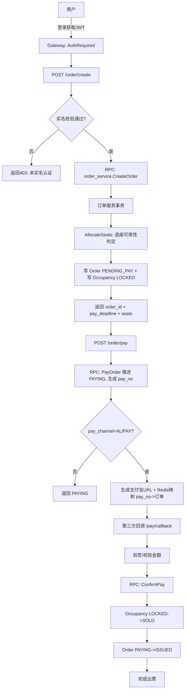
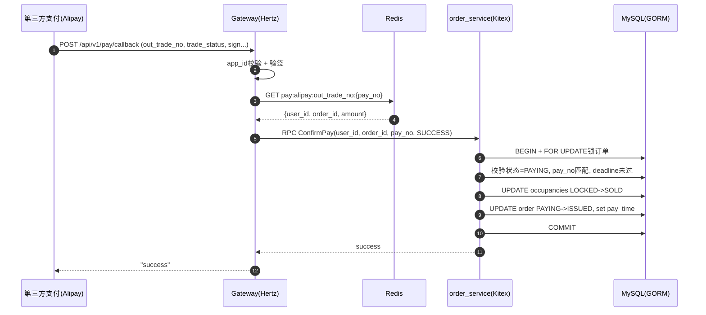

# 项目讲解：piaowu（车票/票务 + 订单支付）系统

## 1. 项目要解决什么问题（需求）

这个项目实现了一个“简化版的线上购票系统”，把典型的购票链路拆成三层：
- **HTTP 网关（Gateway）**：对外提供 REST API + 静态页面；做鉴权、参数校验、少量聚合逻辑
- **后端 RPC 服务（Kitex）**：承载业务用例与状态机（用户、票务、订单）
- **数据与缓存**：MySQL（GORM）存业务主数据，Redis 做缓存/热度/支付临时映射

### 1.1 对外能力（HTTP API）

HTTP 路由集中在 [router.go](file:///d:/gowork/2304a/piaowu/internal/gateway/http/router/router.go#L38-L96)，统一前缀 `/api/v1`，包含：

- **用户域**
  - 注册：`POST /api/v1/user/register`
  - 登录：`POST /api/v1/user/login`
  - 实名：`POST /api/v1/user/verify_realname`（需登录）
  - 个人信息：`GET/POST /api/v1/user/profile`（需登录）
  - 常用乘车人：`GET /api/v1/user/passengers`（需登录）

- **票务查询域**
  - 站点联想：`GET /api/v1/station/suggest`
  - 车次搜索：`GET /api/v1/train/search`（支持游标分页、可选余票/最低价、缓存）
  - 车次详情：`GET /api/v1/train/detail`
  - 余票 WebSocket 推送：`GET /api/v1/ticket/ws`

- **订单域（买票链路）**
  - 下单并锁座：`POST /api/v1/order/create`（需登录 + 实名）
  - 发起支付：`POST /api/v1/order/pay`（需登录）
  - 支付回调：`POST /api/v1/pay/callback`（模拟/对接第三方通知）
  - 触发模拟回调：`POST /api/v1/pay/mock_notify`（需登录）
  - 取消：`POST /api/v1/order/cancel`（需登录）
  - 退票：`POST /api/v1/order/refund`（需登录）
  - 改签：`POST /api/v1/order/change`（需登录）
  - 查询详情：`GET /api/v1/order/info`（需登录）
  - 查询列表：`GET /api/v1/order/list`（需登录）

### 1.2 核心业务对象（数据模型）

模型在 [internal/model](file:///d:/gowork/2304a/piaowu/internal/model)：
- **TrainInfo / TrainStationPass**：车次与途经站（含站序、到发时刻）
- **SeatInfo**：车次座位（车厢/座号/席别/价格）
- **SeatSegmentOccupancy**：区间占用（用来表达“某座位在某区间是否被锁/售”）  
  见 [seat_segment.go](file:///d:/gowork/2304a/piaowu/internal/model/seat_segment.go#L10-L24)
- **OrderInfo / OrderSeatRelation / PassengerInfo**：订单、订单座位关系、乘客信息  
  见 [order.go](file:///d:/gowork/2304a/piaowu/internal/model/order.go#L10-L60)

### 1.3 服务入口（运行形态）

主要入口：
- 网关： [gateway/main.go](file:///d:/gowork/2304a/piaowu/cmd/gateway/main.go)
- 三个后端 RPC 服务：  
  [user_service/main.go](file:///d:/gowork/2304a/piaowu/cmd/user_service/main.go)、[ticket_service/main.go](file:///d:/gowork/2304a/piaowu/cmd/ticket_service/main.go)、[order_service/main.go](file:///d:/gowork/2304a/piaowu/cmd/order_service/main.go)

公共初始化（配置/MySQL/Redis）在 [init.go](file:///d:/gowork/2304a/piaowu/common/init/init.go#L29-L49)。

## 2. 需求是怎么落地的（实现方案）

### 2.1 “查询票务”方案

车次搜索的核心实现是 [SearchTrain](file:///d:/gowork/2304a/piaowu/internal/gateway/ticket/search_train.go#L16-L245)：
- 先做输入校验、日期解析、时间窗裁剪、游标解码
- 用 Redis 记录“热度”，按热度动态调整缓存 TTL（热点更短 TTL，降低脏读时间窗）
- 查询主列表：通过 `train_station_passes dep` 与 `arr` 的 Join，定位“包含该区间的车次”
- 对每个候选车次并发计算：
  - 区间余票（Redis 缓存 + SQL 回源）：[getRemainingSeatsSegment](file:///d:/gowork/2304a/piaowu/internal/gateway/ticket/remain_cache.go#L139-L177)
  - 最低价（Redis 缓存 + SQL 回源）：[getMinPrice](file:///d:/gowork/2304a/piaowu/internal/gateway/ticket/remain_cache.go#L184-L214)
- 支持 `has_ticket` 过滤 + 排序（price/remain/time）+ 返回 next_cursor

同时实现了一个非常轻量的熔断：连续 5 次 DB 错误后短暂 open 3 秒，见 [breakerState](file:///d:/gowork/2304a/piaowu/internal/gateway/ticket/remain_cache.go#L14-L42)。

### 2.2 “下单锁座”方案

下单用例在订单服务的 [CreateOrder](file:///d:/gowork/2304a/piaowu/internal/ticket_service/app/orderapp/create_order.go#L22-L196)：
- 校验入参（用户、车次、区间、乘客、席别、人数上限）
- 校验车次存在且未发车，校验区间站序 `from_seq < to_seq`
- 生成：
  - `order_id`（UUID）
  - `pay_deadline`（默认 15 分钟）
  - `idempotent_key`（用户+车次+区间+乘客证件+席别组合 MD5，用于防重复提交）
- 在 **同一个 DB 事务** 中完成：
  1) 调用票务域的座位分配边界能力 [AllocateSeats](file:///d:/gowork/2304a/piaowu/internal/ticket_service/app/ticketapp/inventory.go#L14-L61) 拿到可用 seat 列表与金额  
  2) 写入订单（状态 `PENDING_PAY`）  
  3) 写入区间占用 `SeatSegmentOccupancy`（状态 `LOCKED`，带 `lock_expire_time=pay_deadline`）  
  4) 写入乘客与订单-座位关系，回填总金额  

### 2.3 “支付/回调/出票”方案

支付状态流转在 [payment.go](file:///d:/gowork/2304a/piaowu/internal/ticket_service/app/orderapp/payment.go)：
- 发起支付：[PayOrder](file:///d:/gowork/2304a/piaowu/internal/ticket_service/app/orderapp/payment.go#L19-L75)
  - `PENDING_PAY` → `PAYING`，生成/复用 pay_no
  - 通过行锁（`FOR UPDATE`）保证同一订单并发支付请求只会推进一次
- 确认支付（回调）：[ConfirmPay](file:///d:/gowork/2304a/piaowu/internal/ticket_service/app/orderapp/payment.go#L77-L144)
  - 校验订单状态必须 `PAYING`，校验 pay_no 匹配，校验 deadline 未过期
  - 将该订单的占用 `LOCKED` 批量更新为 `SOLD`
  - 订单状态推进到 `ISSUED` 并记录 pay_time

网关侧第三方回调入口在 [PayCallback](file:///d:/gowork/2304a/piaowu/internal/gateway/http/handler/order/handler.go#L219-L297)：
- 兼容支付宝 `form-urlencoded` 通知
- 校验 app_id、验签
- 通过 Redis 临时映射 `out_trade_no(pay_no) -> (user_id, order_id, amount)` 定位业务订单
- 调用 RPC `ConfirmPay` 完成出票

## 3. 项目难点是什么（以及怎么解决）

### 3.1 区间购票的“座位可用性判定”

难点：不是“一个座位是否被占用”，而是“一个座位在某个区间是否被占用”。  
区间重叠的判定需要满足：`existing.from_seq < new.to_seq AND existing.to_seq > new.from_seq` 才算冲突。

解决：
- 用 **SeatSegmentOccupancy** 记录每次锁座/售票的区间占用
- 在 [AllocateSeats](file:///d:/gowork/2304a/piaowu/internal/ticket_service/app/ticketapp/inventory.go#L34-L58) 中使用 `NOT EXISTS (...)` + 重叠条件过滤掉冲突座位
- 对候选座位加 `FOR UPDATE`，降低并发下“同一座位被同时分配”的概率
- 对 LOCKED 的过期占用做“尽力清理”（事务内先把过期 LOCKED 改为 CANCELLED）

### 3.2 并发下单/支付的一致性

难点：下单涉及多表写入（订单、占用、乘客、关联），支付确认又涉及占用与订单状态一致推进。

解决：
- 下单在一个事务内完成“分配座位 + 写订单 + 写占用 + 写关联”，要么全部成功，要么全部回滚
- 支付与确认支付也都在事务内，并使用行锁保证状态机单向推进

### 3.3 重复提交（幂等）

难点：用户/前端重试可能导致重复下单，造成库存与金额错误。

解决：
- 用 [buildOrderIdempotentKey](file:///d:/gowork/2304a/piaowu/internal/ticket_service/app/orderapp/create_order.go#L215-L238) 生成幂等键
- 数据库对 `idempotent_key` 加 uniqueIndex（见 [OrderInfo](file:///d:/gowork/2304a/piaowu/internal/model/order.go#L10-L32)）
- 命中唯一键冲突时，回查原订单并直接返回（见 [loadIdempotentOrder](file:///d:/gowork/2304a/piaowu/internal/ticket_service/app/orderapp/create_order.go#L240-L276)）

### 3.4 票务查询的性能与稳定性

难点：车次搜索可能是高频接口，且每条车次都要计算余票/最低价，容易“放大”数据库压力。

解决：
- Redis 缓存余票与最低价，热点越大 TTL 越短（降低缓存击穿/雪崩风险的同时兼顾新鲜度）
- 并发计算余票与价格，减少单次请求尾延迟
- 轻量熔断（短期开路），防止持续 DB 故障把网关打满

## 4. 还能怎么优化（建议方向）

按“效果最明显/改动可控”排序：

1) **座位分配更强一致性**：目前 `AllocateSeats` 只对 seat_infos 行加锁，仍可能在极端并发下出现竞争窗口；可考虑：
   - 引入“区间库存表/分段库存计数”，下单先扣减计数再分配座位
   - 或对 `seat_segment_occupancies` 引入更强的唯一约束（如基于 seat_id + segment 的归一化表达）

2) **余票计算从“按请求实时 Count”升级到“预聚合”**：
   - 站序不多时可做二维前缀和/区间缓存
   - 采用位图/布隆结构加速 seat 可用性筛选（先粗过滤，再精确 SQL）

3) **标准化可观测性**：
   - 统一 trace_id 贯穿网关与 RPC（当前模型已有 trace_id 字段，但链路注入/透传可更系统化）
   - 增加关键指标：下单成功率、库存不足率、支付超时率、回调成功率、DB/Redis 延迟

4) **服务治理**：
   - RPC 直连可升级为注册发现（Consul/Nacos/Etcd）+ 超时/重试策略
   - 网关与服务端统一限流/熔断策略与降级兜底

5) **安全与风控**：
   - 支付回调增加更严谨的幂等：按 `pay_no`/`trade_no` 做回调去重
   - 实名与乘车人信息脱敏输出（已有 desensitize 工具，可结合 DTO 层统一处理）

## 5. 流程图（Flowchart）

### 5.1 购票主流程（下单 → 支付 → 出票）



### 5.2 车次搜索流程（缓存 + 并发补充余票/最低价）

```mermaid
flowchart TD
  A[GET /train/search] --> B[参数校验/解析日期/游标]
  B --> C{缓存命中?}
  C -- 是 --> D[直接返回]
  C -- 否 --> E[查询车次列表 Join dep/arr]
  E --> F[并发: 余票Count(带缓存)]
  E --> G[并发: 最低价MIN(带缓存)]
  F --> H[组装items]
  G --> H
  H --> I[过滤has_ticket/排序]
  I --> J[写入缓存+返回]
```

## 6. 时序图（Sequence）

### 6.1 下单锁座（CreateOrder）

```mermaid
sequenceDiagram
  autonumber
  participant U as 用户
  participant G as Gateway(Hertz)
  participant O as order_service(Kitex)
  participant DB as MySQL(GORM)

  U->>G: POST /api/v1/order/create
  G->>DB: 查询用户实名状态
  alt 未实名
    DB-->>G: realname_verified != VERIFIED
    G-->>U: 403 未实名认证
  else 已实名
    G->>O: RPC CreateOrder(user_id, train_id, segment, passengers)
    O->>DB: BEGIN
    O->>DB: 查询车次/站序校验
    O->>DB: AllocateSeats (FOR UPDATE + NOT EXISTS 冲突过滤)
    O->>DB: INSERT order(PENDING_PAY)
    O->>DB: INSERT occupancies(LOCKED, lock_expire_time=deadline)
    O->>DB: INSERT passengers + relations
    O->>DB: COMMIT
    O-->>G: order_id + seats + pay_deadline
    G-->>U: 200 success
  end
```



### 6.2 支付回调确认（PayCallback → ConfirmPay）



